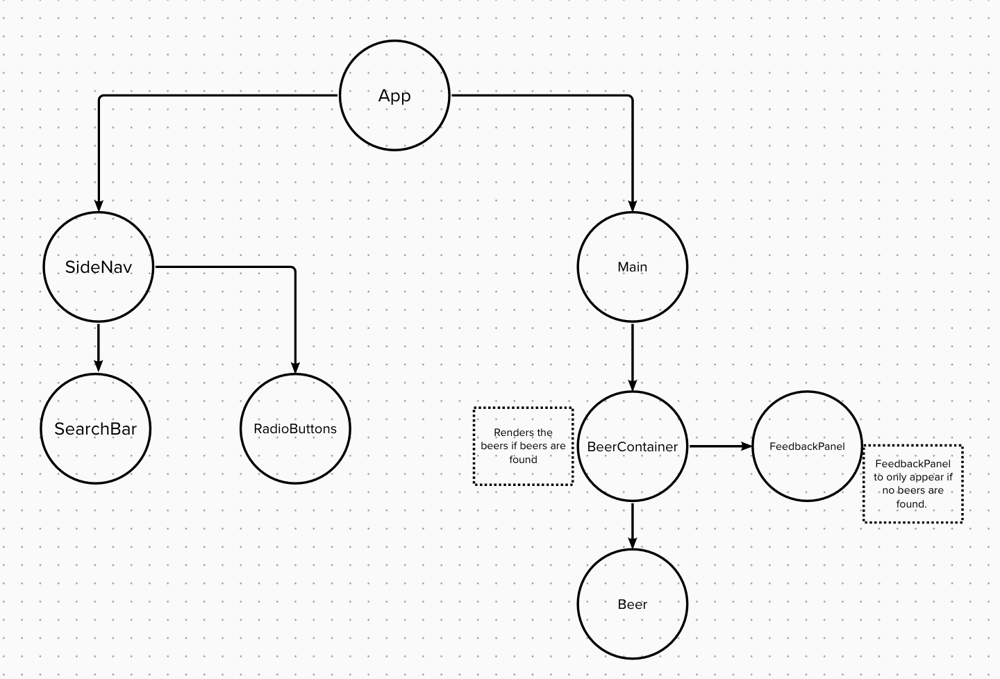

## Brewdog API Project

# Description
I undertook this project as part of a coding course after completing a module focusing on interacting with APIs within React. 

The page displays a range of beers that can be filtered according to search terms and/or radio buttons. The project allowed me to practise different ways of manipulating data from an API and presenting it in different ways. For example, some of the beers did not have images so I 'cleaned' the data before using it, in doing so adding in a placeholder image to accompany the beer information. 

I was also able to implement newly gained knowledge on how to fetch different types of data from an API by dynamically changing the API address. One element of this I found challenging was increasing the amount of beers that were displayed on the page from the initial maximum of 80. I got around this by looping over the fetch thereby calling it multiple times to display all the data together. 

Producing this project allowed me to encounter new problems such as this and work out solutions. 

# Usage Instructions
TBC

# Project files
index.js etc. 
TBC

# Project component tree

# Credits
Beer background image provided by 'upklyak' via Freepik
Data from the Brewdog 'Punk API' https://punkapi.com/

